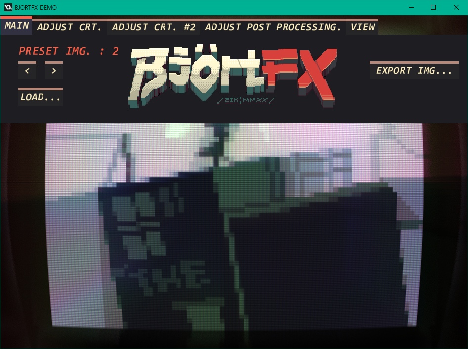
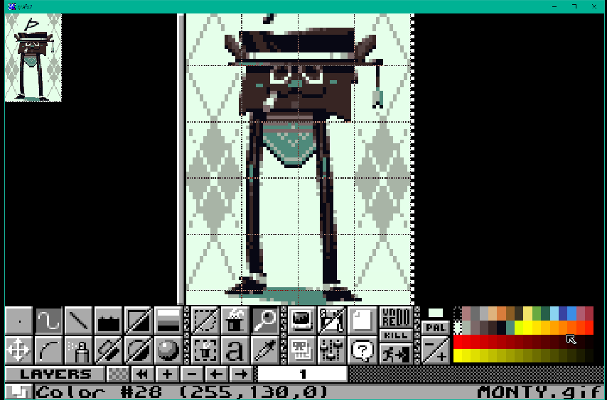
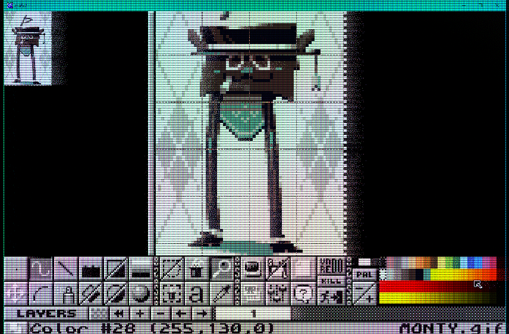
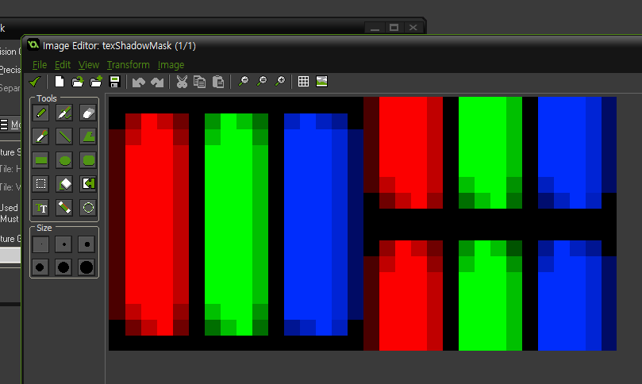
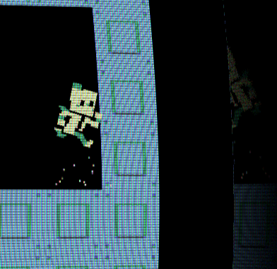
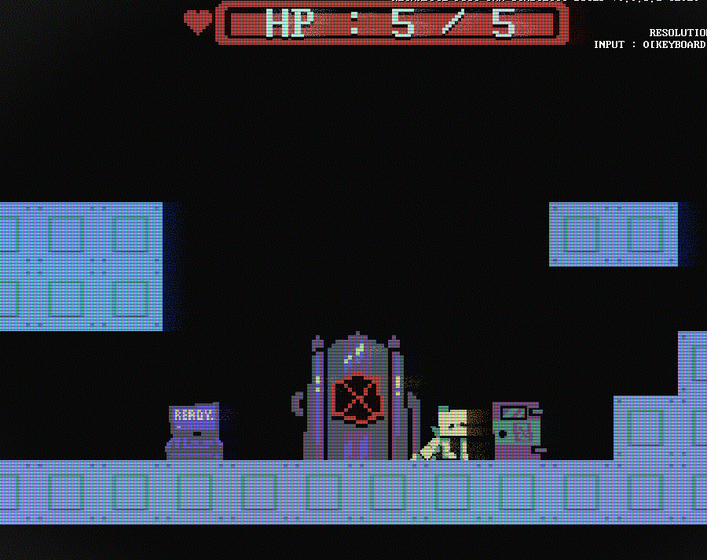
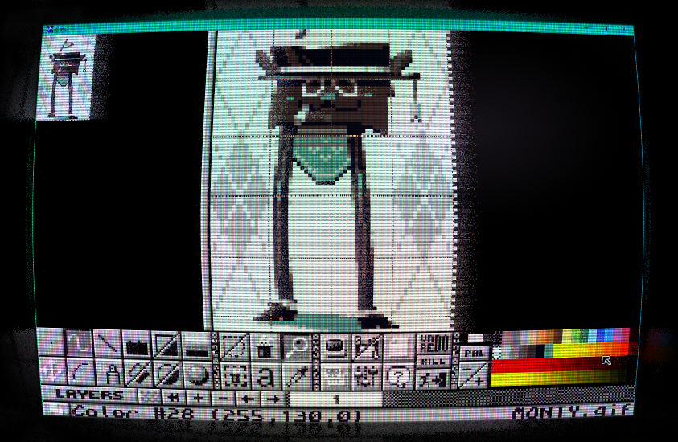
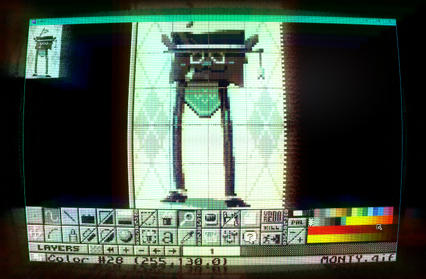
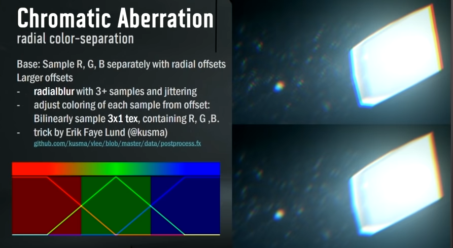

:tv: BJÖRTFX : Shader based, CRT-like retro screen post-processing effect utility / example :tv:
====



# see the tech demo's binary build at this itch.io link : [HERE](https://zikbakguru.itch.io/bjrtfx)

:warning: Description
====
This is the GameMaker 1 project source files of BJÖRTFX, that serves as an example of using a bundle of shader effects for achieving the emulation of retro, CRT-like screen effects to enhance the game's visual quality, and an utility that can be used to create & export images with such shader effects applied as well.

The effects shown here is originally made for [a post-jam graphical update of my latest game jam entry (click here to take a look)](https://zikbakguru.itch.io/jottel) and it has since been modified to have more controls over the effects.

This example GameMaker 1 `.gmx` project folder (`retrofilter_example_project.gmx`) contains total of three shaders (plus an extra one for this trippy background effect that you can see in the GIFs insdie the `/pics` folder), for each rendering passes.

Using all three shaders will apply the following effects to the image :
* Shadow mask & scanline effect
* Colour bleeding & discolouration emulation
* CRT-like tube distortion, specular and border light reflection
* Vignette / edge darkening effect
* Film grain effect
* Contrast & Brightness adjustments
* Horizontal blur / zoom blur-based glow effect, that can also be tinted to emulate the chromatic aberration effect.

~~You could theoretically port this onto GameMaker 2 but since I don't have any GMS2 licenses at my disposal I can't test & gurantee you that it will be ported flawlessly.~~
EDIT : Thanks to @dev-dwarf, the project has been FLAWLESSLY ported to GMS2!

If you have any questions and problems regarding this project, feel free to contact me via my discord account : `zik#6629`... I'll try my best to help.

:question: How to use
====
This project includes the extension that contains various textures and shaders that is needed for the filter effect, and an object `oBJORTFX` that will handle applying the filter.

The most straightforward way to apply the filter is to import all the assets in the extension and create an instance of `oBJORTFX` in any object. (This needs to be done once, so you'd probably better spawn them in your controller object's create event.)

Then, the object `oBJORTFX` will automatically apply a downscale effect (this can be adjusted via the variable `surfaceDownscaleFactor` in the object) and other filter effects on the `application_surface` on the draw GUI event.

You can modify the variables in the filter handler object to adjust the filter's visuals to your taste.

# :wrench: Technical rundown / shader explaination
## Pass #0 : Original image before applying the FX


Since this effect is meant to be used as Post-processing effect, it requires you to first transfer the screen's data onto a surface (if you hadn't already)
and then use that surface to draw a full-screen quad.

## Pass #1 : CRT-screen filter (`shd_retroscreen_screenfilter`)


In this pass, The shader `shd_retroscreen_screenfilter` is used to apply the following effects to the screen texture :
* [Shadow mask](https://en.wikipedia.org/wiki/Shadow_mask) emulating/mimicking effect
* [Scan line](https://en.wikipedia.org/wiki/Scan_line) emulating/mimicking effect
* Colour bleeding artifact emulating effect
* Dynamic & static screen tint/discolouration effect
* Vignette & film grain effect
* Brightness & Contrast adjustment

Here's more details about some of the techniques that I thought was interesting to talk about :

### A] Shadow mask and Scanlines

The shadow mask effect is achieved by tinting (= multiplying the source colour with tinting colour) the screen's colour with colour from a special shadow mask texture that features separate 'mask' for red, green, blue channel that is offseted vertically for every 2nd column.



This creates this peculiar alternating patterns of red, green and blue that is commonly seen on the CRT screens.

For the scanlines, I used a very similar method. But instead of using textures, I've used the screen's UV coordinates to calculate the vertically alternating pattern and used that for applying the scanlines.

The following code is from the actual shader, that applies shadow mask and scanline effect :
```
/// Apply scanline and shadowmask effect
// (final is vec3 variable that holds the final screen colour)
float scanlinenum   = (1.0 / uScreenTexelSize.y) / 4.0;
float scanline      = mix(1.0 - uScanlineIntensity, 1.0, abs(0.5 - fract(uv.y * scanlinenum)) * 2.0);
vec3 shadowmask     = sampleShadowmask(uv);
final *= shadowmask * scanline;
```

### B] Colour bleeding and dynamic discolouration
The colour bleeding might seem like an ordinary horizontally blurred effect that was achieved with loops in the shader.

But suprisingly, it wasn't; I've used a thing called Dithering to make a single-sample blur much more feasible to eyes.

```
/// Current pixel's dithering value, fetched from dithering noise texture
float dithernoise = noise(uv);
    
/// Apply colour bleeding effect
vec3 bleedtreshold = vec3(0.4, 0.5, 0.3); // minimum threshold value of colourbleed for each colour channel
vec3 bleedtint     = vec3(1.0, 0.8, 0.9); // colourbleed's tint
vec2 bleeduvoffset = vec2(uScreenTexelSize.x * -uBleedSize * (dithernoise - 0.3), 0.0); // uv offset used for sampling screen texture
// (get neighbor's rgb colour)
vec3 neighbor = texture2D(gm_BaseTexture, uv + bleeduvoffset).rgb;
// (calculate colourbleed's final intensity from rgb colour and add to final colour)
float finalluma = (final.r + final.g + final.b) / 3.0;
vec3 neighbormixfactor = smoothstep(bleedtreshold, vec3(0.9), neighbor) * (smoothstep(1.0, 0.0, finalluma) * 0.8 + 0.2);
final += neighbor * neighbormixfactor * uBleedIntensity * bleedtint;
```
If you look at the above image close enough, you can actually notice that the colour bleeding effect is somewhat 'grainy'... that's because I've used a blue noise to apply some offsets to the UV used for sampling the screen texture, in order to achieve the quick yet hacky blur.


Meanwhile, for the dynamic discolourlation effect I've used an oldschool demoscene effect : The plasma effect. Using that, I've tinted the screen in order to get a dynamically moving screen discolouration effect.

## Pass #2 : Distortion & reflections (`shd_retroscreen_distortion`)


In this pass, The shader `shd_retroscreen_distortion` is used to apply the following effects to the screen texture :
* CRT-like distortion
* Screen border reflection
* Subtle specular lighting effect

Like before, I think those techniques were worth talking about :

### A] The CRT-like distortion
This effect was quite simple; I've applied zoom on the screen with the zoom intensity determined from current pixel's distance to the center of screen.

```
// Distorts UV like a CRT monitor
vec2 getCRTUV (vec2 uv, float distortion)
{
    vec2 centerDelta = vec2(0.5) - uv;
    float centerDist = length(centerDelta);
    float distortfactor = centerDist;
    uv -= 0.5;
    uv *= mix(1.0, 1.0 + distortion, distortfactor);
    uv += 0.5;
    return uv;
}
```

### B] The border reflection

The border reflection was achieved quite similar, by distorting the UV and applying another distortion to UV when the UV is outside of the screen boundary.
```
 // Calculate delta between center and warped UV
vec2 warpedCenterDelta = vec2(0.5) - uv;
float warpedCenterDist = length(warpedCenterDelta);

// UV mirror trick by https://blog.nobel-joergensen.com/2011/09/17/mirror-texture-coordinates-in-unity/
// apply UV mirroring AFTER we've calculated the center delta to prevent the mixing values being mirrored too
uv = fract(uv * 0.5) * 2.0;
uv = vec2(1.0) - abs(uv - vec2(1.0));

// Calculate 'border' distortion
const float borderdistortamp = 0.4;
float bordercornerfade = 1.0 - max(abs(0.5 - uv.x) + abs(0.5 - uv.y) - 0.75, 0.0) * 2.0;
float borderfade = 1.0; // smoothstep(0.95, 1.0, fadefactor);
float borderdistortfactor = smoothstep(0.4, 0.7, distortfactor) + max(max(abs(0.5 - uv.x), abs(0.5 - uv.y)) - 1.0, 0.0); // smoothstep(0.0, 0.7, distortfactor);
uv -= 0.5;
uv *= mix(1.0, 1.0 - distortion, borderfade * borderdistortfactor * borderdistortamp);
uv += 0.5;

// Apply blurring on the 'border' side of the uv, by using the dithering
vec2 blurfactor = uScreenTexelSize * 8.0 * smoothstep(0.4, 0.625, warpedCenterDist);
uv += blurfactor * vec2(dithernoise * 2.0 - 1.0, noise(uv.yx) * 2.0 - 1.0) * borderfade;
```
And like how I've implemented the colour bleeding blur, I've used dithering to spread out the UV in order to 'blur' the border region's colours.

## Pass #3 : Finishing touches (`shd_retroscreen_postprocessing`)


In this pass, The shader `shd_retroscreen_postprocessing` is used to apply the following effects to the screen texture :
* Zoom & horizontal blurred glow effect
* Rainbow-Tinted glow that can be used for chromatic aberration effect

For those effects, I've simply used a combination of radial/zoom in blur to emulate a some sort of god rays-like effect.



But on top of that effect, I've also used a little hack I've learned before; I've used a GPU's texture interpolation & a lookup texture to tint the sample's colour in order to implement the 'rainbow-y' chromatic aberration effect!

For more info about this particular 'hack', go watch [this specific part of GDC talk by Mikkel Gjoel](https://youtu.be/RdN06E6Xn9E?t=427) (...Or even better; Watch the whole damn thing! It's a great compilation of useful shader stuffs & I've learnt a lot of things from that video, especially about the dithering)

This is the snippet of the code that does the radial/zoom blur and tinting/chromatic aberration effect :
```
vec3 glowblur = vec3(0.0);

const float blurIteration       = 8.0;
const float blurIterationStep   = 1.0 / blurIteration;
const float blurIterationWeight = 1.0 / (blurIteration + 1.0);
for (float i=0.0; i<=(1.0 - blurIterationStep); i+=blurIterationStep)
{
    // dither up
    float i_interp = i + blurIterationStep * dithernoise;
    vec2 uvoff = vec2((i_interp - 0.5) * 2.0 * uBlurSize * uScreenTexelSize.x, 0.0);
    float zoomoff = ((i_interp - 0.5) * 2.0 * uBlurZoomIntensity);
    
    // calculate 'tint' from rainbow/chromatic aberration lookup texture
    vec3 tint = mix(vec3(1.0), texture2D(uTexRainbow, vec2(i_interp, 0.5)).rgb, uGlowTintIntensity);
    
    vec3 col = tint * sampleScreen(uv + uvoff, 1.0 - zoomoff, zoomoff).rgb;
    glowblur += col * blurIterationWeight;
}
```

# :copyright: License & Credits
## License
The code used for this project is distributed under the MIT License.

The assets used (the preset pixel art images provided with the example) are distributed under the Creative Commons Attribution 4.0 International License.

For further information, please refer to the license files `LICENSE.txt` and `LICENSE_ASSETS.txt`.

## Credits & Special thanks
* [PilotRedSun](https://www.youtube.com/user/PilotRedSun) : For introducing & inspiring me with the retro VHS look in his videos
* [GDC talk on the game INSIDE's rendering tech, by PlayDead's Mikkel Gjoel and Mikkel Svendsen](https://youtu.be/RdN06E6Xn9E) : For inspiring me to use the linear interpolated RGB lookup table for chromatic aberration effect AND introducing me the concept of dithering
* GameMaker Studio 1 and it's creator YoYo Games : For making the game engine that honestely made all of this possible for me
* Everyone who has supported me in various means such as buying my game (that this tech was originally created on) and showcasing it
